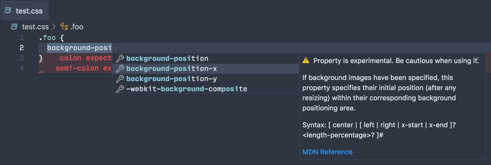

  <h2 align="center">VS Code Custom Data</h2>
  Documentation, sample and data for using VS Code's HTML/CSS custom data format.

## Synopsis

VS Code ships with rich [language feature support](https://code.visualstudio.com/api/language-extensions/programmatic-language-features) for HTML/CSS, such as auto-completion and hover information. The core of these language support are implemented in [vscode-html-languageservice](https://github.com/microsoft/vscode-html-languageservice) and [vscode-css-languageservice](https://github.com/microsoft/vscode-css-languageservice). In the past, these libraries were coupled to outdated schemas that define HTML/CSS entities. Custom data decouples these libraries from the data they use and allows VS Code to offer up-to-date support for latest HTML/CSS proposals or frameworks built on top of HTML/CSS.

## Usage

There are two primary use cases:

1. You can use settings, `html.customData` and `css.customData` in your settings to let VS Code load additional HTML/CSS entities, so they would show up in auto-completion, hover information etc. See [helloworld sample](./samples/helloworld) for an example.
2. You can use [Contribution Points](https://code.visualstudio.com/api/references/contribution-points), `contributes.html.customData` or `contributes.css.customData` to load Custom Data into VS Code. See [vscode-mavo](https://github.com/octref/vscode-mavo) for an example.

## Explanation

Take this HTML auto-completion example:

`<|`

- `vscode-html-languageservice` determines that it should provide a list of tag names, such as `div`, `span`, `p`.
- By default, VS Code provides data extracted from HTML spec to `vscode-html-languageservice`, so `<|` completes all HTML tags described in the HTML spec.
- The `html.customData` setting and `contributes.html.customData` allows you to extend this list to include your own definition of HTML tags.

On the one hand, we continuously curate the data VS Code provides to the HTML/CSS language services. For example, VS Code pulls data from [mdn/data](https://github.com/mdn/data) and [mdn/browser-compat-data](https://github.com/mdn/browser-compat-data) to provide latest information on CSS properties' usage, syntax and browser compatibility. By continously following the latest web spec, VS Code can provide latest information & up-to-date language support for new HTML/CSS entities.

  

On the other hand, for users and framework authors who build new technologies and frameworks on top of HTML/CSS, custom data offers an easy way for them to add support for their custom frameworks. For example:
- WebComponents-based frameworks can statically analyze their components and emit a JSON file following the custom data schema to get language support.
- Vue language server can analyze Vue components and load custom data into its `vscode-html-languageservice` based Language Server to provide Vue-specific auto-completions.

  

## Documentation

- [HTML Custom Data](https://github.com/microsoft/vscode-html-languageservice/blob/master/docs/customData.md)
- [CSS Custom Data](https://github.com/microsoft/vscode-css-languageservice/blob/master/docs/customData.md)

## Schemas and Versioning

- [Latest HTML Schema, V1.1](https://github.com/microsoft/vscode-html-languageservice/blob/master/docs/customData.schema.json)
- [Latest CSS Schema, V1.1](https://github.com/microsoft/vscode-CSS-languageservice/blob/master/docs/customData.schema.json)

### Versioning

- Schemas are versioned in the format of `<Major>.<Minor>`.
- `Minor` changes are backwards compatible. Custom data that satisfies `V1.X` spec would be valid according to `V1.0` spec.
- `Major` changes introduce breaking changes. Custom data that satisfies `V2.X` spec would likely be invalid according to `V1.0` spec.

## Samples

- [`samples/helloworld`](./samples/helloworld): Open this sample in VS Code and start playing with custom data.
- [`samples/svg`](./samples/svg): A real-world sample that loads SVG-related HTML/CSS entities in VS Code.
- [`samples/webcomponents`](./samples/webcomponents): Use custom data to get web component editor support in HTML.
- [`octref/vscode-mavo`](https://github.com/octref/vscode-mavo): Use custom data to support the [Mavo framework](https://mavo.io) built on top of HTML/CSS.

## Web Data

`/web-data` contains the data collection pipelines and the actual data being used in the VS Code [HTML extension](https://github.com/microsoft/vscode/tree/master/extensions/html-language-features) and [CSS extension](https://github.com/microsoft/vscode/tree/master/extensions/css-language-features). It pulls data from sources such as HTML/CSS spec and MDN and massages them into the custom data format ready to use.

## Updating Web Data

- Run `yarn update-sources`, which updates `@mdn/browser-compat-data`, `mdn-data` and `attributeRelevance.js`
- After all updates are done, run `yarn generate-data`
- Review the diff. Make sure the updates look reasonable. If there are new properties, make sure that they don't have blank descriptions. There is no API for pulling descriptions. Each time you regenerate the data, if there are properties with missing descriptions, find its MDN page, go to https://github.com/microsoft/vscode-custom-data/blob/master/web-data/css/mdn/mdn-documentation.js and update it manually
- Finally, commit and publish the data to [@vscode/web-custom-data](https://www.npmjs.com/package/@vscode/web-custom-data) on NPM. 

## Contributing

This project welcomes contributions and suggestions.  Most contributions require you to agree to a
Contributor License Agreement (CLA) declaring that you have the right to, and actually do, grant us
the rights to use your contribution. For details, visit https://cla.opensource.microsoft.com.

When you submit a pull request, a CLA bot will automatically determine whether you need to provide
a CLA and decorate the PR appropriately (e.g., status check, comment). Simply follow the instructions
provided by the bot. You will only need to do this once across all repos using our CLA.

This project has adopted the [Microsoft Open Source Code of Conduct](https://opensource.microsoft.com/codeofconduct/).
For more information see the [Code of Conduct FAQ](https://opensource.microsoft.com/codeofconduct/faq/) or
contact [opencode@microsoft.com](mailto:opencode@microsoft.com) with any additional questions or comments.
